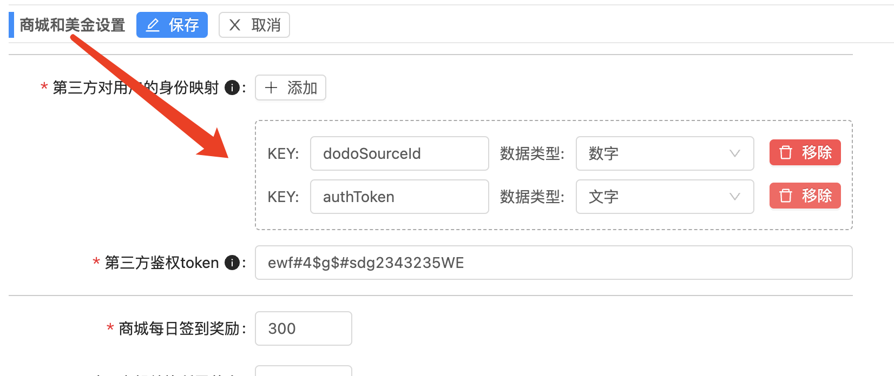
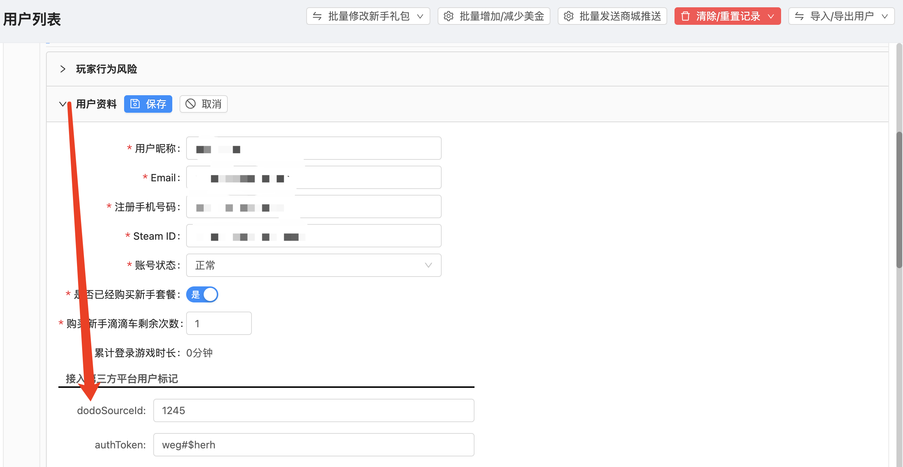

# 第三方群管工具用的商城OpenAPI
版本 V1.0
### API调用说明
调用接口之前应当向希望使用第三方群管工具的服主客户取得商城**第三方鉴权token**，该token可在商城后台的**商城配置管理**->**商城和美金设置**里面设置，请各位服主客户保护好自己的第三方鉴权token，发现外泄后应立刻重新生成token以避免损失。

商城OpenAPI遵循最低限度的restful API设计模式，以下是调用接口时必须使用的公共请求头
```javascript
req.header["scum-store-token"] = `${你获得的第三方鉴权token}`
```
一般情况下第三方群管工具依附的平台会有一些字段用来表示用户唯一身份标识，这些字段应当在商城后台的**商城配置管理**->**第三方对用户的身份映射**里面登记，目前支持`number`和`string`两种类型。登记之后服主客户可以在商城后台的**商城用户管理**->**用户资料**里面给特定玩家设置唯一身份标识。V1.0版本只支持商城管理员给特定玩家设置用户身份标识，后续会启用通过OpenAPI或者玩家自行绑定账号的渠道(只会支持个别主流的账号类型例如DODO和QQ)



以DODO语音聊天频道为例子，DODO语音账号的身份标识字段为`dodoSourceId`，可能还有一个叫`authToken`的字段用作校验（我瞎猜的）。那么调用接口时请求头应当加上以上两个字段用来区分是哪个商城用户，格式为**scum-store-你的字段名**，例如：
```javascript
req.header["scum-store-dodoSourceId"] = `${DODO语音账号的dodoSourceId}`
req.header["scum-store-authToken"] = `${DODO语音账号的authToken}`
```
### 一种简单的接入和使用流程
1. 服主设置好**第三方鉴权token**和**第三方对用户的身份映射**
2. 服主给需要通过第三方渠道使用商城的玩家设置好身份标识
3. 玩家在第三方软件的群组内发送绑定账号的指令消息
4. 群管工具调用接口在群组内推送必要的商城信息
5. 玩家在第三方软件的群组内发送购买等指令消息

### API返回结构体和返回码含义
调用OpenAPI返回的内容的`Content-Type`为`application/json`，一般格式为以下的json
```typescript
{
  "status": number, // 返回码，调用成功为200
  "data": any, // 返回内容，可能为任何类型，一般是object类型
  "msg": string, // 返回状态信息，status为200时一般为空
}
```
以下是返回码`status`常见的值和含义
1. `200`: 正常调用
2. `500`: 非法调用或者请求体畸形被阻拦
3. `59999`: 内部错误，也可能由不正确/非法调用的参数引起，详细请看返回状态信息msg
4. `60001`: OpenAPI鉴权不通过
5. `60005`: 参数不正确/缺失或重复导致调用失败

### API列表
#### POST /user/userCheckInThirdParty
##### 说明
玩家在商城签到获取奖励
##### 入参
无
##### 出参
```json
{
  "status": 200
  "data": {},
  "msg": "签到成功，奖励xx美金"
}
```
#### GET /itemTypes/listThirdParty
##### 说明
获取商品种类列表
##### 入参
|参数名|必填|参数类型|数据类型|描述|默认值|
| :------------ | :------------ | :------------ | :------------ | :------------ | :------------ |
|id|否|query|number|分类ID|无|
|name|否|query|string|分类英文名|无|
|cnName|否|query|string|分类中文名|无|
|fatherItemTypeId|否|query|string|父类ID|无|
##### 出参
```json
{
  "status": 200
  "data": {
    "list": [], // 列表
    "count": 0, // 总数
  },
  "msg": ""
}
```
**list.item**
```json
{
  "id": 1, // 类型ID
  "name": "leixing1", // 英文类型
  "cnName": "类型1", // 中文类型
  "fatherItemTypeId": 2, // 所属父类型ID
  "topTimeStamp": 1703591681000, // 置顶时间的毫秒时间戳
  "createdTimeStamp": 1703591681000 // 类型添加时间的毫秒时间戳
  ...
}
```
#### GET /itemTypes/listChildrenThirdParty
##### 说明
获取商品子分类列表
##### 入参
|参数名|必填|参数类型|数据类型|描述|默认值|
| :------------ | :------------ | :------------ | :------------ | :------------ | :------------ |
|fatherItemTypeId|是|query|string|父类ID|无|
##### 出参
```json
{
  "status": 200
  "data": {
    "list": [], // 列表
    "count": 0, // 总数
  },
  "msg": ""
}
```
**list.item**
```json
{
  "id": 1, // 类型ID
  "name": "leixing1", // 英文类型
  "cnName": "类型1", // 中文类型
  "fatherItemTypeId": 2, // 所属父类型ID
  "topTimeStamp": 1703591681000, // 置顶时间的毫秒时间戳
  "createdTimeStamp": 1703591681000 // 类型添加时间的毫秒时间戳
  ...
}
```
#### GET /item/listThirdParty
##### 说明
获取商品列表
##### 入参
|参数名|必填|参数类型|数据类型|描述|默认值|
| :------------ | :------------ | :------------ | :------------ | :------------ | :------------ |
|type|是|query|string|英文类型|无|
##### 出参
```json
{
  "status": 200
  "data": {
    "list": [], // 列表
    "count": 0, // 总数
  },
  "msg": ""
}
```
**list.item**
```json
{
  "id": 1, // 类型ID
  "name": "shangpin1", // 商品名称
  "type": "leixing1", // 英文类型
  "configType": "command", // 发货类型(command打指令发货|dollar商城美金)
  "price": 200, // 价格
  "imgSrc": '', // 商品图片URL
  "sales": 10, // 销量
  "configs": {
    "addDollar": 0, // 发货类型为美金时，发放的美金数量
    "levelPurchaseLimit": [ // 按等级限制购买参数
      "level": 1, // 等级
      "purchaseLimit": { // 购买频率限制
      "time": 50, // 频率限制次数
      "each": "day_start" // 频率周期(second秒|minute分钟|hour小时|day一天[24小时]|day_start[0点归零]|week一周[7天]|week_start一周[周一归零]|month一个月[30天]|month_start一个月[1号归零]|once永久)
      }
    ],
    "totalLimit":1, // 抢购商品件数
    "buyLimit": 2 // 一个用户终生可以购买该商品的次数(0为不启用)
    "multiple": true, // 是否套餐
    "multiTime": 7, // 套餐包含次数(multiple=false的时候不生效)
    "levelLimitType": ">=", // 等级购买限制类型(">=大于等于|>大于)
    "levelLimit": 0, // 等级购买限制>=|>多少等级
    "purchaseLimit": { // 购买频率限制
      "time": 50, // 频率限制次数
      "each": "day_start" // 频率周期(second秒|minute分钟|hour小时|day一天[24小时]|day_start[0点归零]|week一周[7天]|week_start一周[周一归零]|month一个月[30天]|month_start一个月[1号归零]|once永久)
    }
  },
  "topTimeStamp": 1703591681000, // 置顶时间的毫秒时间戳
  "createdTimeStamp": 1703591681000 // 类型添加时间的毫秒时间戳
  ...
}
```
#### POST /buy/addNormalThirdParty
##### 说明
玩家在商城购买正常商品
##### 入参
|参数名|必填|参数类型|数据类型|描述|默认值|
| :------------ | :------------ | :------------ | :------------ | :------------ | :------------ |
|itemId|是|json|number|物品ID|无|
|number|是|json|number|数量[1-10]|无|
|buyMode|否|json|string|购买模式(squad/own)|无|
##### 出参
```json
{
  "status": 200
  "data": object,
  "msg": ""
}
```
#### POST /buy/addMultiThirdParty
##### 说明
玩家在商城购买多种商品(限购物车模式启用，从"GET /serverConfig/thirdPartyConfigs"接口获取到enablePurchaseMultiItem判断是否开启)
##### 入参
|参数名|必填|参数类型|数据类型|描述|默认值|
| :------------ | :------------ | :------------ | :------------ | :------------ | :------------ |
|items|是|json|array|物品{ "id": number(物品ID), "number": number(数量[1-10]) }|无|
|buyMode|否|json|string|购买模式(squad/own)|无|
##### 出参
```json
{
  "status": 200
  "data": object[],
  "msg": ""
}
```
#### POST /buy/addWelcomePackThirdParty
##### 说明
玩家在商城领取新手礼包
##### 入参
|参数名|必填|参数类型|数据类型|描述|默认值|
| :------------ | :------------ | :------------ | :------------ | :------------ | :------------ |
|itemId|是|json|number|物品ID(从"GET /item/listThirdParty"接口获取type为"special-welcomepack"的商品)|无|
##### 出参
```json
{
  "status": 200
  "data": object,
  "msg": ""
}
```
#### POST /buy/addHotPointTeleportThirdParty
##### 说明
玩家在商城购买热点传送
##### 入参
|参数名|必填|参数类型|数据类型|描述|默认值|
| :------------ | :------------ | :------------ | :------------ | :------------ | :------------ |
|itemId|是|json|number|物品ID(从"GET /item/listThirdParty"接口获取type为"special-hot-point-teleport"的商品)|无|
|name|是|json|string|热点地区名称(从"GET /serverConfig/thirdPartyConfigs"接口获取到hotPointTeleportPoint数组里面每一项的name)|无|
##### 出参
```json
{
  "status": 200
  "data": object,
  "msg": ""
}
```
#### POST /buy/addDollarAddThirdParty
##### 说明
玩家在商城购买美金礼包(仅限configType=dollar的商品，该类型商品购买后即获得商城美金)
##### 入参
|参数名|必填|参数类型|数据类型|描述|默认值|
| :------------ | :------------ | :------------ | :------------ | :------------ | :------------ |
|itemId|是|json|number|物品ID|无|
|buyMode|否|json|string|购买模式(squad/own)|无|
##### 出参
```json
{
  "status": 200
  "data": object,
  "msg": ""
}
```
#### GET /serverConfig/thirdPartyConfigs
##### 说明
获取群管机器人所需的参数
##### 入参
无
##### 出参
```json
{
  "status": 200
  "data": {
    "specialHotPointTeleportItem": item object, // 热点传送功能对应的形式商品，存储通用的购买限制、价格等信息
    "hotPointTeleportPoint": [], // 热点传送列表
    "enablePurchaseMultiItem": true, // 是否开启购物车模式
  },
  "msg": ""
}
```
**hotPointTeleportPoint.item**
```json
{
  "name": "B4交易站", // 热点地区名称
  "description": "B4交易站", // 热点地区描述(展示在商城上的名称)
  "price": 100, // 专属价格，优先级大于热点传送功能对应的形式商品上面的价格
  ...
}
```